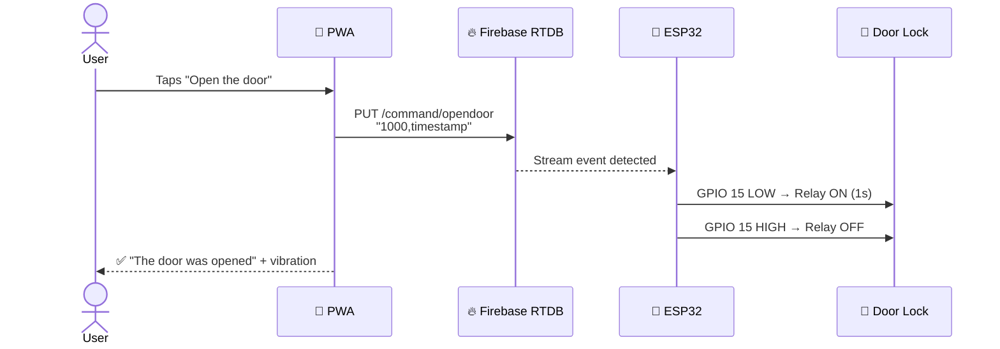
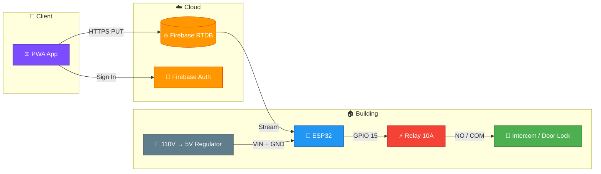
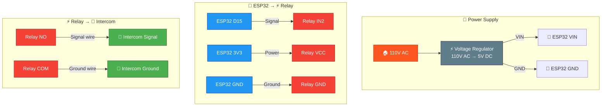

<div align="center">

# 🚪 AutomaticDoor

**Open your building's door from anywhere with a tap on your phone**

[](LICENSE)


---

An IoT system that acts as an **interceptor for a 4-wire intercom**, where 2 of the wires control the door lock (signal + ground). A **PWA web app** communicates with an **ESP32** microcontroller through **Firebase Realtime Database** to trigger a relay that opens the door.

</div>

---

## 🧠 How It Works



> 1️⃣ The user taps **"Open the door"** on the PWA.
> 
> 2️⃣ The PWA authenticates with Firebase and sends a `PUT` to `/command/opendoor`.
> 
> 3️⃣ The ESP32 detects the change via a persistent stream and activates the relay on GPIO 15 for ~1 second.
> 
> 4️⃣ The relay closes the intercom circuit (signal + ground), unlocking the door.

---

## 🏗️ Architecture



---

## 🔧 Hardware

| Component | Description |
|:---:|---|
| 🤖 **ESP32** (WiFi + BT) | Microcontroller — connects to Firebase and controls the relay |
| ⚡ **Relay module 10A** | Switches the intercom door-open circuit |
| 🔌 **Mini voltage regulator** | Converts 110V AC → 5V DC to power the ESP32 |
| 🏢 **4-wire intercom** | Building intercom — 2 wires control the door lock |

### ⚡ Wiring Diagram



> 🔌 **Power** — The mini voltage regulator converts 110V AC to 5V DC and feeds the ESP32 through **VIN** and **GND**.
>
> ⚡ **Relay** — Powered at **3.3V** from the ESP32's 3V3 pin. Control signal from **GPIO 15 (D15)** via relay **IN2**.
>
> 🚪 **Door** — Relay configured as **normally open (NO)**: GPIO 15 goes LOW → relay closes → intercom circuit completes → door unlocks.

---

## 💻 Software

### 🤖 ESP32 Firmware — `esp32.ino`

| Feature | Description |
|:---:|---|
| 📶 **WiFi** | Connects to a stored network (credentials saved in NVS flash via `Preferences`) |
| 🔵 **Bluetooth** | Serial interface `DOOR_BT` to configure WiFi credentials. Send `SSID,password` |
| 🔥 **Firebase** | Authenticates with email/password and listens on `/command` via persistent stream |
| 🚪 **Door control** | Parses `"time,timestamp"` and activates relay for `time` ms |
| ⏰ **Watchdog** | Auto-restarts every 6 hours for stability |
| 🔄 **Auto-reconnect** | Handles WiFi drops, Firebase disconnections with exponential backoff |
| 📨 **FCM** | Sends push notification when WiFi reconnects |

### 🌐 PWA Web App

| Feature | Description |
|:---:|---|
| 🧱 **Vanilla stack** | HTML / CSS / JS — no build tools or frameworks |
| 📦 **Service Worker** | Offline caching support |
| 📲 **Installable** | Add to home screen, runs in fullscreen mode |
| 🔐 **Auth** | First-run popup for Firebase email, password & API key (stored in `localStorage`) |
| 🔓 **Door command** | Sends `"1000,{timestamp}"` to Firebase RTDB |
| 📳 **Haptic feedback** | Vibrates the device on successful door open |

---

## 📁 Project Structure

```
📦 AutomaticDoor/
├── 🤖 esp32.ino            # ESP32 Arduino firmware
├── 🌐 index.html           # Main PWA page
├── 📴 offline.html         # Offline fallback
├── 🔒 private.html         # Private page placeholder
├── 📋 pwa-manifest.json    # PWA manifest
├── ⚙️ pwa-sw.js            # Service worker
├── 🎨 css/
│   └── style.css           # Styles
├── 📜 js/
│   └── main.js             # PWA logic (auth + door control)
├── 🖼️ img/                 # Icons (iOS, Android, Windows)
└── 📄 LICENSE              # MIT License
```

---

## 🚀 Setup

### 📋 Prerequisites

- 🛠️ [Arduino IDE](https://www.arduino.cc/en/software) with ESP32 board support
- 🔥 A [Firebase](https://firebase.google.com/) project with:
  - **Realtime Database** enabled
  - **Authentication** (email/password) enabled
  - A registered user account
  - A **service account** with private key
- 🌍 A web server or hosting (e.g. Firebase Hosting, GitHub Pages) to serve the PWA

---

### 1️⃣ Firebase Configuration


1. Create a Firebase project
2. Enable **Realtime Database** and set up security rules for authenticated writes to `/command`
3. Enable **Email/Password authentication** and create a user
4. Generate a **service account private key** from Project Settings → Service Accounts

---

### 2️⃣ ESP32 Firmware

1. Open `esp32.ino` in Arduino IDE
2. Install the required libraries:

   | Library | Source |
   |---|---|
   | `FirebaseESP32` | by mobizt |
   | `Preferences` | built-in |
   | `BluetoothSerial` | built-in |

3. Update the constants with your Firebase project details:

   ```cpp
   #define API_KEY "your-firebase-api-key"
   #define DATABASE_URL "your-project.firebaseio.com"
   #define USER_EMAIL "your-email@example.com"
   #define USER_PASSWORD "your-password"
   #define FIREBASE_PROJECT_ID "your-project-id"
   #define FIREBASE_CLIENT_EMAIL "your-sa@your-project.iam.gserviceaccount.com"
   // Update PRIVATE_KEY with your service account's private key
   ```

4. Select **ESP32 Dev Module** as the board and upload

---

### 3️⃣ WiFi Configuration via Bluetooth

After flashing, the ESP32 starts with default WiFi credentials. To update:

1. 📱 Pair your phone with Bluetooth device **`DOOR_BT`**
2. 📤 Send credentials in format: `SSID,password`
3. ✅ The ESP32 saves to flash and reconnects automatically

**💡 LED Status Indicators:**

| Blinks | Meaning |
|:---:|---|
| 💚💚 | WiFi connected successfully |
| 🔴🔴🔴 | WiFi connection failed |
| 🟡🟡🟡🟡 | Restarting (watchdog) |

---

### 4️⃣ PWA Deployment

1. 🌍 Host the project files on any static web server (HTTPS required for service workers)
2. 📱 Open the URL on your phone's browser
3. 🔐 Enter your Firebase **email**, **password**, and **API key** on first visit
4. 👆 Tap **"Open the door"** to unlock
5. 📲 Add to home screen for quick access

---

## 🔒 Security Considerations

> ⚠️ **Important**: The current code contains hardcoded credentials. Before deploying to production:

| Risk | Recommendation |
|:---:|---|
| 🔑 Hardcoded keys | Replace all Firebase credentials in `esp32.ino` with your own |
| 📂 Public repo | Never commit real credentials — use `.gitignore` for config files |
| 🛡️ DB rules | Set restrictive Firebase RTDB rules — only allow authenticated users |
| 🔄 Token expiry | Implement token refresh in the PWA for long-lived sessions |

---

## 📄 License

This project is licensed under the **MIT License**. See [LICENSE](LICENSE) for details.

---

<div align="center">

Made with ❤️ by **Juan Escorcia**

🤖 ESP32 · 🔥 Firebase · 🌐 PWA

</div>
